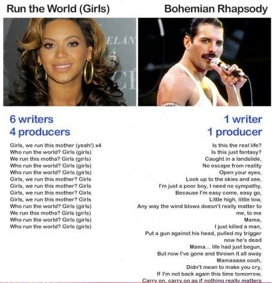

<style>
body {
text-align: justify}
</style>

```{r setup, include=FALSE}
knitr::opts_chunk$set(
  warning = FALSE,
  error = FALSE,
  echo = TRUE,
  message = FALSE,
  fig.align = 'center',
  fig.height = 3.75,
  fig.width = 6
)
```

## Nothing Else Matters

```{r libraries, results = 'hide'}
library(tidytext)
library(dplyr)
library(kableExtra)
library(stringr)
library(ggplot2)
library(tidyr)
library(data.table)
```


*"De gustibus non est disputandum"* - goes the latin phrase.

As each of us have our own preferences in music, different backgrounds that make us resonate with different topics and feelings, it might be the truth that *"In matters of taste, there can be no disputes"*.
However, highly successfull artists can be easily differentiated from mediocre ones. Success can be measured by number of records sold, plays on Spotify, sold-out venues all around the world etc.

The following meme gives an excessive perspective on how song lyrics can be entirely different, coming from two highly successful musicians:

```{r pressure, echo=FALSE, fig.cap="Figure 1: Lyrics depth", out.width = '100%'}

```

This article does not want to take sides with either Beyoncé or Freddy Mercury, but rather investigate the word choices, lyrical motives, topics and feelings used in highly successfull works of music.

Does song lyrics have any impact on the success of an artist, or is it all about production value, catchiness and nothing else matters?


## What Do You Do For Money Honey

```{r import}
require(XLConnect)
wb = loadWorkbook("songlyrics.xlsx")
df = readWorksheet(wb, sheet = "songlyrics", header = TRUE)
```

The `songlyrics.xlsx` dataset contains lyrics for 6 emblematic figures of different genres and times, using their most sold album.

```{r artists, error = FALSE, echo = FALSE}
table <- data.frame(unique(df$artist), unique(df$album))
names(table) <- c("artist", "album")
kable(table, caption = 'Table 1: Artists and albums') %>%
  kable_styling('striped', full_width = F, position = 'center', latex_options = 'hold_position') %>%
  row_spec(0, color = 'white', background = 'orange', align ='c') %>%
  footnote(general = "Source: Wikipedia.org")
```

## Cleanin' Out My Closet

The dataset only needs slight data cleaning:

* In some songs, brackets are used to signal [Verse], [Chorus] or artists that perform a part of the song, [Dr. Dre] etc. These will be removed.
* It needs to be tranformed into `tidytext`˛format: one token (word) per row.
* We have do create a custom stop words dictionary for meaningless words like James Hetfield's *"yeah"*s, Eminem's *"yo"*s and Michael Jackson's *"Ma ma se, ma ma sa, ma ma coo sa"*s.
* Remove numbers.

```{r stopwords}
custom_stop_words <- bind_rows(tibble(word = c("ma","se", "sa", "coo", "yeah", "na", "whoo", "ow", "aw", "ooh",
                                               "yea", "aaaaahaaaahaaaah", "oooh", "ooo", "ha", "vrrm", "dah",
                                               "da", "um", "la", "yo", "huh", "ya", "eh", "ou", "woe", "yoe"), 
                                          lexicon = c("custom")), 
                               stop_words)
```


```{r cleantoken}
tidy_df <- df %>% 
  unnest_tokens(word, lyrics) %>% 
  anti_join(custom_stop_words, by = 'word')

tidy_df <- subset(tidy_df, !grepl("[0-9]", word))
```

## Wanna Be Startin' Somethin'

Let's start by using `dplyr`'s `count()` to find the most common words used:

```{r commonwords}
tidy_df %>%
  count(word, sort = TRUE) %>% 
  filter(n > 50) %>% 
  mutate(word = reorder(word, n)) %>% 
  ggplot(aes(word, n)) +
  ggtitle("Figure 2: Most used words") +
  geom_col() +
  xlab(NULL) +
  coord_flip()
```

It is not surprising that the word *love* is the most used word out of all meaningful words in the dataset. *Gonna* and *wanna* might be considered as stop words. Words like *girl*, *baby* and *heart* are also connected to the topic of love and relationships. Furthermore, we see that Eminem loves talking about himself.

The plot below shows how 3 artists use words differently:

```{r compare}
frequency <- bind_rows(mutate(tidy_df %>% 
                                filter(artist == 'Eminem'), author = 'Eminem'),
                       mutate(tidy_df %>% 
                                filter(artist == 'Adele'), author = 'Adele'),
                       mutate(tidy_df %>% 
                                filter(artist == 'Metallica'), author = 'Metallica')) %>%
  count(author, word) %>% 
  group_by(author) %>% 
  mutate(proportion = n/ sum(n)) %>% 
  select(-n) %>% 
  spread(author, proportion) %>% 
  gather(author, proportion, `Eminem`:`Adele`)

library(scales)
ggplot(frequency, aes(x = proportion, y = `Metallica`, color = abs(`Metallica` - proportion))) +
  geom_abline(color = "gray40", lty = 2) +
  ggtitle("Figure 3: Different word choices") +
  geom_jitter(alpha = 0.1, size = 2.5, width = 0.3, height = 0.3) +
  geom_text(aes(label = word), check_overlap = TRUE, vjust = 1.5) +
  scale_x_log10(labels = percent_format()) +
  scale_y_log10(labels = percent_format()) +
  scale_color_gradient(limits = c(0, 0.001),
                       low = "darkslategray4", high = "gray75") +
  facet_wrap(~author, ncol = 2) +
  theme(legend.position = "none") +
  labs(y = 'Metallica', x = NULL)
```

There are not many common words used by the representatives of different genres. They use *head*, *call* and *boy* in relatively similar proportions, but Metallica sings about being *broken*, *free* and *dream*s way more than Eminem or Adele. 
To quantify their differences, we can use Pierson's correlation. Its 0.03 for Adele and Metallica and 0.09 for Metallica and Eminem.

```{r corrtest}
cor.test(data = frequency[frequency$author == 'Adele', ], ~ proportion + `Metallica`)
cor.test(data = frequency[frequency$author == 'Eminem', ], ~ proportion + `Metallica`)
```

This is expected, as the dataset spans over 31 years (1980-2011) and uses 6 different genres. It was expected that different types of music will have different word choices.


